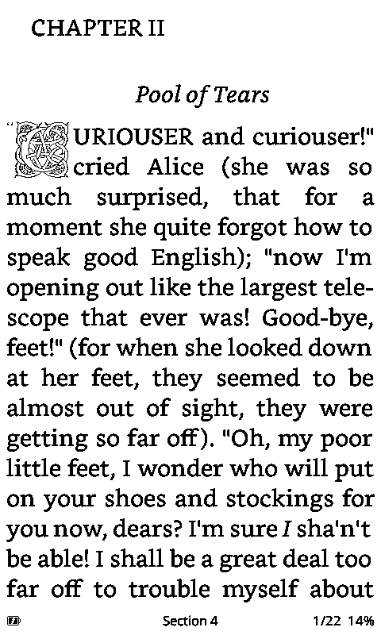
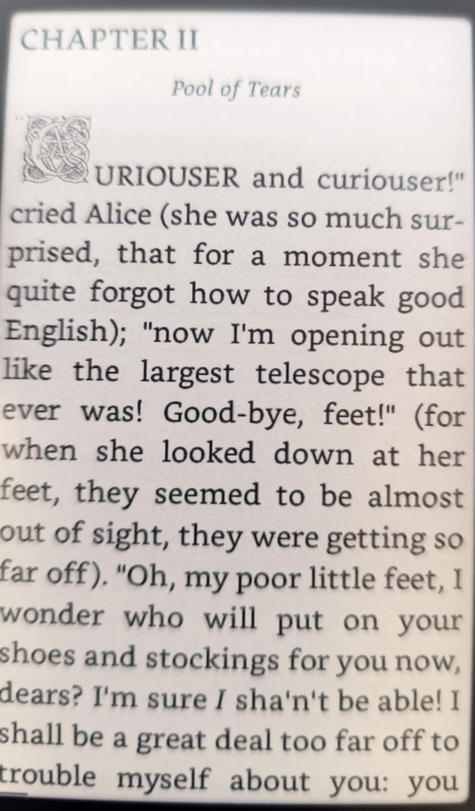
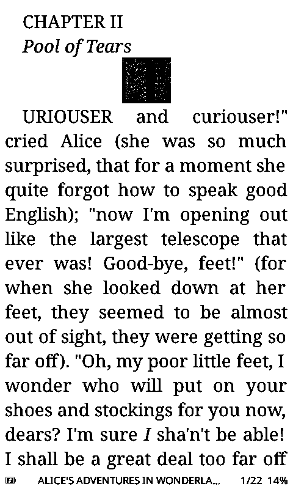
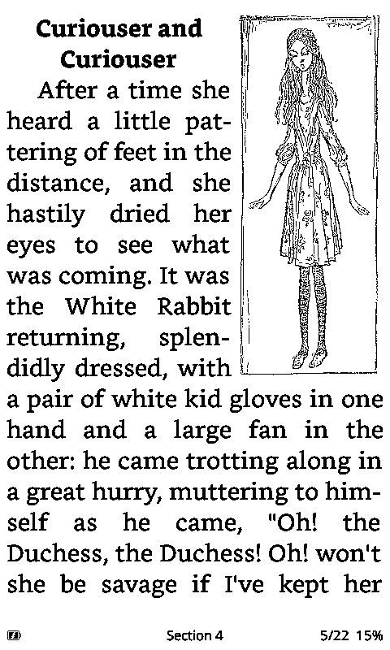
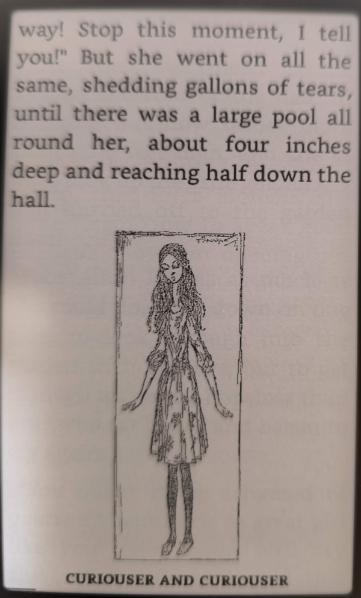
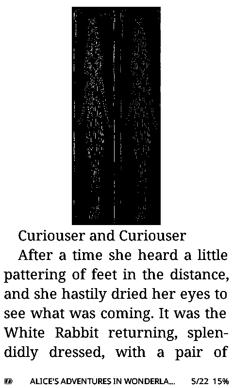
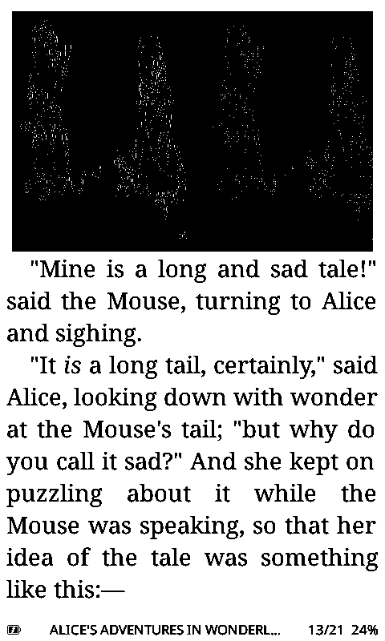
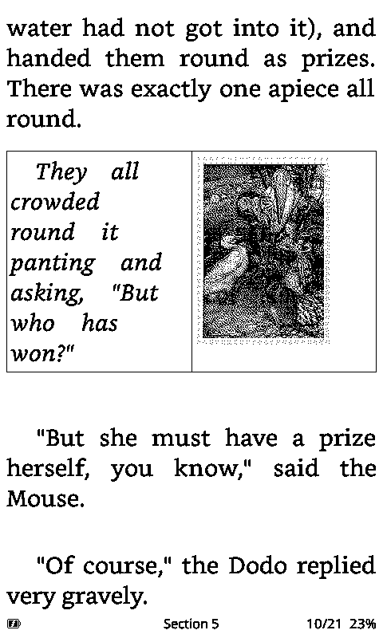
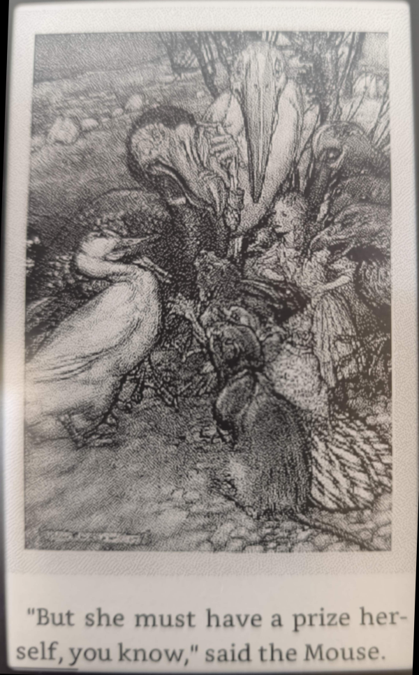
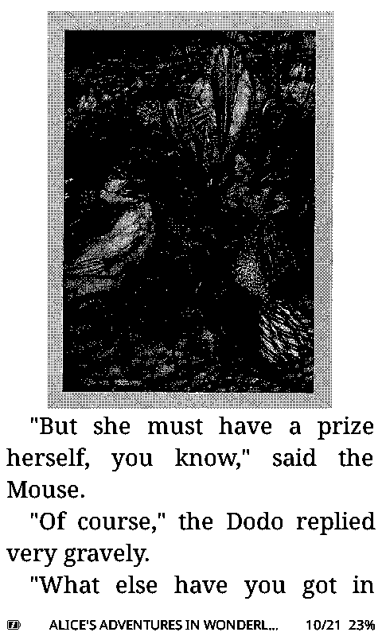

# Witch(hunt) Reader

This firmware is based on the [crosspoint-reader](https://github.com/crosspoint-reader/crosspoint-reader) for the XTEINK X§/X4, a great piece of software by Dave Allie and others.

# What this reader does differently
- Speed - rendering should be *fast*
- CSS layout - a lot of effort have gone into rendering 
- Memory - where others fail Witch Reader still works
- Proper KOReader Snychronisation
- Additional sleep screens support (information overlay, transparent pictures over current reader screen)
- Clock-Support for X4 and X3
- Weather information panel
- Multiple under-the-hood performance improvements
- Book information screen
- Markdown-support
- WiFi captive portal support
- Supporting ~~strikethrough~~, superscript / subscript and tables
- Support for used defined actions on double-click / long-click per button 
- Background preprocessing of sections, so hopefully you will see fewer of the infamous "Indexing" messages
- A lot of smaller quality of life improvements 

# What this reader doesn't
* Great UI design is not necessarily/obviously not a forte of mine, so if you look for a polished look and feel, I would recommend going e.g. to [CrossInk](https://github.com/uxjulia/crossink), a great piece of work by uxJulia
* Support for CJK (Chinese Japanese Korean) - look at https://github.com/aBER0724/crosspoint-reader-cjk
* Right-to-left rendering support (Hebrew, Arabic) - choose the original [CrossPoint](https://github.com/crosspoint-reader/crosspoint-reader) firmware
* The most memory efficient reader might still be [MicroReader](https://github.com/CidVonHighwind/microreader) by CidVonHighwind

All of them have their strengths and constraints (as has Witch reader), so they deserve a testrun before you decide which one is right for you

# Why this name
Originally this fork was called CrossPoint++ - it had a small userbase and then I made an honest mistake by reusing the crosspoint fork, providing ample reference in the PRs and the release notes of code origin and authorship but was losing the github commit author information in the progress when I copied code over instead of taking the tedious (and correct) way of cherrypicking the original commit and post-cleanup effort.

Another crosspoint developer approached me pointing this flaw out and I agreed to change the future integration work. What I did not care for was that persons attitude and way of communicating, and I told him so.

Then all hell broke lose, ending up in insults, harassment and plain lies in other forums without even caring for feedback (a good cause for any lawsuit for slander). So I took the repo down and just continued the development for my own benefit.

Still I wanted others to benefit from my progress, so here we are again:

Witch(hunt) Reader (name for obvious reasons) 

- So if you are one of those who felt poorly appreciated: please accept my apologies, that was never my intent, and I have taken a lot of effort to replace code / to properly attribute the origin of code or ideas
- If you are one of those who felt the need to raise a witchhunt, to lie, to libel: just go away - trolls aren't welcome here or more clearly: F*** OFF

# Rendering comparisons
Rendering examples from [Alice in Wonderland](https://www.gutenberg.org/ebooks/28885)
| Item 	|Witch Reader |	Micro Reader 1) 2) | CrossPoint |	Stock |
| --- | --- | --- | --- | --- |
| Floating images 1 |   |  |    |    |
| Floating images 2 |   |    |    |    |
| CSS Rendering |   |   |  |    |
| Graphics |   |   |   |    |
| Images in tables |   |   |   |    |

1) Apologies for the poor image quality of the microreader screenshots, i needed to make photos with my mobile, as I couldn't figure out how to create screenshots from within the reader
   
2) The Rendering of the Mouse poem in MicroReader is even more refined, it manages to deal with different font sizes, too

# Attributions
If in doubt consider all the work being done here based on the work of others - especially crosspoint reader (as the ancestor of this version) and microreader have been a great source of inspiration.

## Project ancestry & inspiration
- **crosspoint-reader** by Dave Allie and others — the direct ancestor this firmware is forked from. https://github.com/crosspoint-reader/crosspoint-reader (MIT).
- **MicroReader** by CidVonHighwind — a source of inspiration, and still the most memory-efficient reader for the X4. https://github.com/CidVonHighwind/microreader
- **OpenX4 E-Paper Community SDK** (a.k.a. crosspoint-xdk) — the shared X3/X4 hardware/display/utility libraries, included as a submodule. https://github.com/open-x4-epaper/community-sdk (MIT).

## Vendored third-party components (`lib/`)
These are bundled directly in the repository. Each retains its upstream copyright header in source.

- **TJpgDec — Tiny JPEG Decompressor** by ChaN (R0.03) — baseline-JPEG decode engine for the EPUB image path. http://elm-chan.org/fsw/tjpgd/ — Copyright (C) 2021 ChaN, BSD-1-Clause. Vendored under [`lib/TJpgDec`](lib/TJpgDec); modified from upstream in `tjpgdcnf.h` (config + the `JD_FASTPATH` IRAM macro) and `tjpgd.c` (the `JD_FASTPATH` annotations on the hot decode functions, plus a `BYTECLIP` clamp on the grayscale output path fixing an upstream wrap-around bug — black speckle in high-contrast covers when `JD_FASTDECODE≥1`); `tjpgd.h` is verbatim.
- **yxml** by Yoran Heling — the XML/HTML SAX parser backend (`SaxParser`), used by the EPUB and OPDS parsers. https://dev.yorhel.nl/yxml — Copyright (c) 2013-2014 Yoran Heling, MIT. Vendored under [`lib/SaxParser`](lib/SaxParser).
- **uzlib** by Joergen Ibsen and Paul Sokolovsky — tiny DEFLATE/inflate, used for ZIP/EPUB extraction and PNG inflate. https://github.com/pfalcon/uzlib — Copyright (c) 2003 Joergen Ibsen, (c) 2014-2018 Paul Sokolovsky, zlib license. Vendored under [`lib/uzlib`](lib/uzlib).
- **QR-Code-generator (qrcodegen)** by Project Nayuki — QR code generation. https://github.com/nayuki/QR-Code-generator — Copyright (c) Project Nayuki, MIT. Vendored under [`lib/QRCode`](lib/QRCode).

## External libraries (PlatformIO `lib_deps`)
Pulled from the PlatformIO registry at build time.

- **ArduinoJson** by Benoît Blanchon — JSON parsing/serialization. https://github.com/bblanchon/ArduinoJson — MIT.
- **arduinoWebSockets** by Markus Sattler — WebSocket client (KOReader sync). https://github.com/Links2004/arduinoWebSockets — LGPL-2.1.
